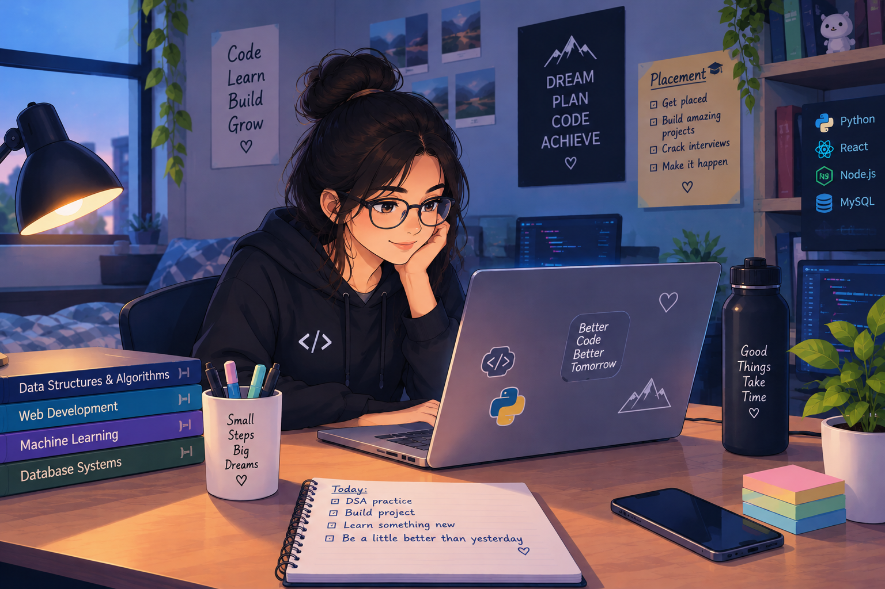

# 👋 Hi, I'm Devi Sri

### Full-Stack Developer | AI/ML Enthusiast | Data Explorer | Software Developer

  
  

  
  
  

---

## 👩‍💻 About Me

I'm a Computer Science & Business Systems student passionate about building practical software and exploring emerging technologies.

I enjoy developing full-stack applications, experimenting with AI/ML, working with data, and continuously improving my problem-solving skills through DSA.

- 💻 Building full-stack applications
- 🤖 Exploring AI & Machine Learning
- 📊 Working with data and business intelligence
- 🧩 Practising DSA with Python
- 🚀 Learning by building real-world projects

---

## 🛠️ Technologies & Tools

  ### 💻 Languages

  

  ### 🌐 Frontend

  

### ⚙️ Backend

  

### 🤖 Data & AI

  
  

### 🗄️ Databases

  

### 🔧 Tools

  

---

---
## 📚 Currently Learning

&nbsp;

  

&nbsp;

  

---

## 📊 GitHub Statistics

---

## 📈 GitHub Activity

---

## 🏆 GitHub Contributions

---

## 🎯 What I'm Looking For

Open to opportunities where I can contribute to real-world software projects, strengthen my development skills, and continue exploring AI/ML and data-driven solutions.

---

## 🌐 Let's Connect

---

### 💡 Building. Learning. Improving. 🚀

