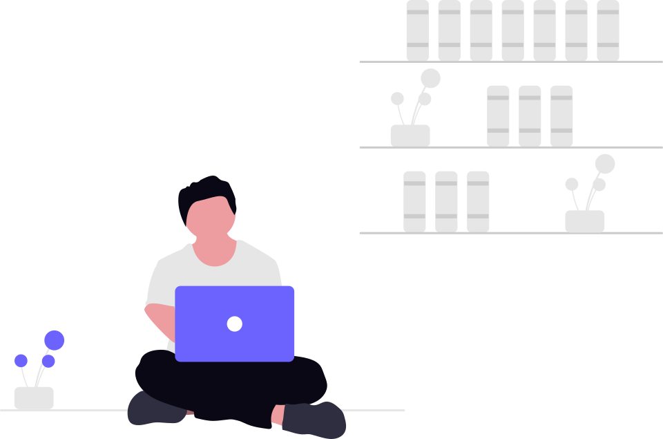

# 👋 Hi, I'm Devi Sri

### Full-Stack Developer | AI/ML Enthusiast | Data Explorer | Software Developer

  
  

  
  
  

---

## 👩‍💻 About Me

I'm a Computer Science & Business Systems student passionate about building practical software and exploring emerging technologies.

I enjoy developing full-stack applications, experimenting with AI/ML, working with data, and continuously improving my problem-solving skills through DSA.

- 💻 Building full-stack applications
- 🤖 Exploring AI & Machine Learning
- 📊 Working with data and business intelligence
- 🧩 Practising DSA with Python
- 🚀 Learning by building real-world projects

---

## 🛠️ Technologies & Tools

### 💻 Languages

  

### 🌐 Frontend

  

### ⚙️ Backend

  

### 🤖 Data & AI

  
  

### 🗄️ Databases

  

### 🔧 Tools

  

---

## 🚀 Featured Projects

<table>
<tr>

<td width="50%">

### 🎓 Campus Connect Hub

A full-stack campus collaboration platform for students to discover study groups, notes, events, Q&A, teammates and mentors.

**Tech Stack**

`React` `Node.js` `Express` `MySQL` `JWT`

 

</td>

<td width="50%">

### 📄 AI Resume Analyzer

An AI-powered platform for resume analysis, ATS evaluation, skill identification, job-description matching and improvement suggestions.

**Tech Stack**

`Python` `FastAPI` `React` `AI/LLM` `PostgreSQL`

 

</td>

</tr>

<tr>

<td width="50%">

### 📊 Retail Business Intelligence

An interactive analytics dashboard for monitoring retail KPIs, sales performance, profitability and product/customer insights.

**Tech Stack**

`Python` `Streamlit` `Plotly` `MySQL`

 

</td>

<td width="50%">

### 🌱 OptiCrop

A machine-learning based crop recommendation application using agricultural and environmental parameters.

**Tech Stack**

`Python` `Flask` `Machine Learning` `Bootstrap`

 

</td>

</tr>
</table>

---

## 📚 Currently Learning

---

## 📊 GitHub Statistics

---

## 📈 GitHub Activity

---

## 🏆 GitHub Contributions

---

## 🎯 What I'm Looking For

Open to opportunities where I can contribute to real-world software projects, strengthen my development skills, and continue exploring AI/ML and data-driven solutions.

---

## 🌐 Let's Connect

---

### 💡 Building. Learning. Improving. 🚀

